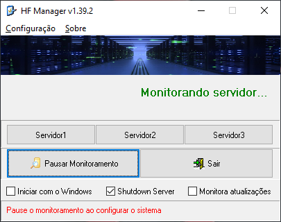
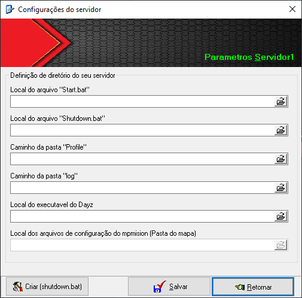

HF Manager é um sistema de gerenciamento de servidores DayZ e que monitora até 3 servidores.

TAREFAS EXECUTADAS NESTA VERSÃO
=

- Desligamento automático em horário predefinido para realização de backup;
- Realiza backup em local definido pelo usuário, quando assim configurado;
- Realiza, também, backup na nuvem, quando assim configurado;
- Desliga o gerenciador de backup, na nuvem, após o término da tarefa;
- Inicia novamente o servidor após concluir o backup;
- Move arquivos de log da pasta "Profile" para a pasta "log" na raiz do DayZ, organizando-os por data
  sempre que o servidor reiniciar;
- Restart em horário predefinido;
- Monitora se o servidor está ativo e, caso tenha caído, o inicia novamente;
- Monitora atualização de MODs e, caso encontre, realiza o seguinte procedimento: 
     -Envia mensagem para o Discord informando sobre a atualização e que o servidor será encerrado; 
     -Atualiza os MODs detectados; 
     -Envia mensagem para o Discord informando quais MODs foram atualizados; 
     -Envia mensagem para o Discord informando que os MODs já foram atualizados e que o servidor será iniciado; 
  NOTA: Se o mod a ser atualizado não está em uso no servidor, será atualizado normalmente e informado no discord
  para que assim a administração possa acompanhar tais atualizações.
- Monitora atualização do DayZ e executa os mesmos procedimentos das atualizações de MODs;
- Ao atualizar o DayZ, os arquivos da pasta 'mpmission' não são atualizados automaticamente. No entanto,
  quando o Webhook estiver devidamente configurado, o administrador será notificado sobre quaisquer alterações nesses 
  arquivos. Essa funcionalidade auxilia a equipe de administração a acompanhar as modificações realizadas na versão 
  atual do DayZ;
- Sempre que o servidor é iniciado, envia para o Discord um "LOG" com a posição dos veículos no mapa. 
  Assim, caso algum player tenha perdido seu veículo durante o reinício, basta consultar a posição no canal do Discord 
  (Necessário mod MCK). Funcionalidade opcional.
  NOTA: Opção para excluír da mensagem os veículos vanilla
- Monitora mudanças no IP do modem e, caso ocorram, envia uma mensagem para o Discord informando sobre a 
  alteração.
- Monitora spaw do KOTH e envia a hora de inicio do evento para o discord;
      -Com este procedimento, resolve-se o problema do player não saber se dará tempo de ir ao KOTH;
      -Configuração exclusiva para o KOTH informado na pagina de webhook correspondente;
- Criação do arquivo "shutdown.bat" de forma automática;
- Possibilidade de envio do arquivo "crash" para o discord, se assim configurado.
- Possibilidade de envio do arquivo "serverconsole" para o discord, se assim configurado.

Nota:

- O Sistema pode ser integrado ao BEC, mas se utiliza-lo. Desative o restart pelo BEC;
- Integração, também, com o OmegaManager, mas deixe rodando somente o terminal que busca atualizações da steam;
- Período de teste: 30 dias;
- Discord: https://discord.gg/Sfvm9TMRur
  
Tela de monitoramento do sistema: 
  
Tela de configuração de diretórios: 
  
Tela de configuração para atualização de MOD: 
  
Tela de configuração para atualização do DAYZ: 
  

