HF Manager é um sistema de gerenciamento de servidores DayZ e que monitora até 3 servidores.

TAREFAS EXECUTADAS NESTA VERSÃO
=

- Desligamento automático em horário predefinido para realização de backup;
- Realiza backup em local definido pelo usuário, quando assim configurado;
- Realiza, também, backup na nuvem, quando assim configurado;
- Desliga o gerenciador de backup, na nuvem, após o término da tarefa;
- Inicia novamente o servidor após concluir o backup;
- Move arquivos de log da pasta "Profile" para a pasta "log" na raiz do DayZ, organizando-os por data
  sempre que o servidor reiniciar;
- Restart em horário predefinido;
- Opção de enviar mensagem ao discord informando sobre o restart e parada para backup;
- Monitora se o servidor está ativo e, caso tenha caído, o inicia novamente;
- Opção para iniciar o BEC se utilizado e assim desejado;
- Integração com a Steam para: Baixar, atualizar e monitorar atualizações de mod na steam de forma automática;
     IMPORTANTE: Diferente de outros gerenciadores onde seus dados de login e senha da steam ficam expostos na 
     maquina, aqui seus dados são codificados e não são mais apresentados na forma originial. Nem mesmo para quem
     os inseriu
- Gerenciador de mod instalado, no qual é possível realizar as seguintes tarefas:
     Exibe em uma única tela os seguintes dados:
          Todos os mod baixados da steam
          Todos os mod na pasta do servidor
          Todos os mod em uso no BAT
     Com estes dados apresentados é possível: Remover mod das pastas da steam e do servidor, evitando o acumulo 
     de mod baixado sem estarem em uso
     Opção para remover mod da linha de comando do BAT sem precisar abrir o aquivo
     Opção para abrir o arquivo BAT em modo edição para conferência, caso necessário e assim desejado
- Monitora atualização de MODs no servidor e, caso encontre, realiza o seguinte procedimento:
     Envia mensagem para o Discord informando sobre a atualização e que o servidor será encerrado;
     Atualiza os MODs detectados;
     Envia mensagem para o Discord informando quais MODs foram atualizados;
     Envia mensagem para o Discord informando que os MODs já foram atualizados e que o servidor será iniciado;
  NOTA: Se o mod a ser atualizado não está em uso no servidor, será atualizado normalmente e informado no discord
  para que assim a administração possa acompanhar tais atualizações.
- Monitora atualização do DayZ e executa os mesmos procedimentos das atualizações de MODs;
- Ao atualizar o DayZ, os arquivos da pasta 'mpmission' não são atualizados automaticamente. No entanto,
  quando o Webhook estiver devidamente configurado, o administrador será notificado sobre quaisquer alterações 
  nesses   arquivos. Essa funcionalidade auxilia a equipe de administração a acompanhar as modificações realizadas na 
  versão atual do DayZ;
- Sempre que o servidor é iniciado, envia para o Discord um "LOG" com a posição dos veículos no mapa. 
  Assim, caso algum player tenha perdido seu veículo durante o reinício, basta consultar a posição no canal do Discord 
  (Necessário mod MCK). Funcionalidade opcional.
  NOTA: Opção para excluír da mensagem os veículos vanilla
- Possíbilidade de integração com discord para envio de 'LOG' de veículos destruídos
- Monitora mudanças no IP do modem e, caso ocorram, envia uma mensagem para o Discord informando sobre a 
  alteração.
- Monitora spaw do KOTH e envia a hora de inicio do evento para o discord;
      Com este procedimento, resolve-se o problema do player não saber se dará tempo de ir ao KOTH;
      Configuração exclusiva para o KOTH informado na pagina de webhook correspondente;
- Alteração no arquivo 'serverDZ.cfg' em tempo de execução;
- Opção para definir alguns parametros de funcionamento do sistema;
- Criação do arquivo "shutdown.bat" de forma automática;
- Possibilidade de envio do arquivo "crash" para o discord, se assim configurado;
- Possibilidade de envio do arquivo "serverconsole" para o discord, se assim configurado;
- Remoção de log antigo de forma automática;
- Remoção de backup antigo de forma automática, sendo possível configurar a quantidade a ser mantido.

Nota:

- O Sistema pode ser integrado ao BEC, mas se utiliza-lo. Desative o restart pelo BEC;
- Integração, também, com o OmegaManager, mas deixe rodando somente o terminal que busca atualizações da steam;
- Período de teste: 30 dias;
- Discord: https://discord.gg/Sfvm9TMRur
  
Tela de monitoramento do sistema: 
  
Tela de configuração de diretórios: 
  
Tela de configuração para atualização de MOD: 
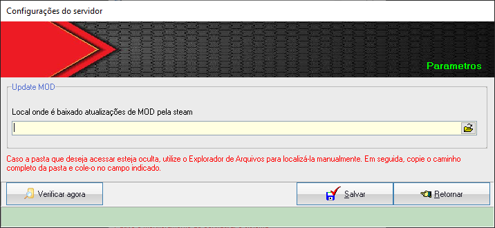  
Tela de configuração para atualização do DAYZ: 
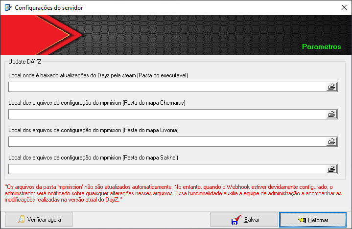  
Tela de configuração do webhook Update Mod e Dayz: 
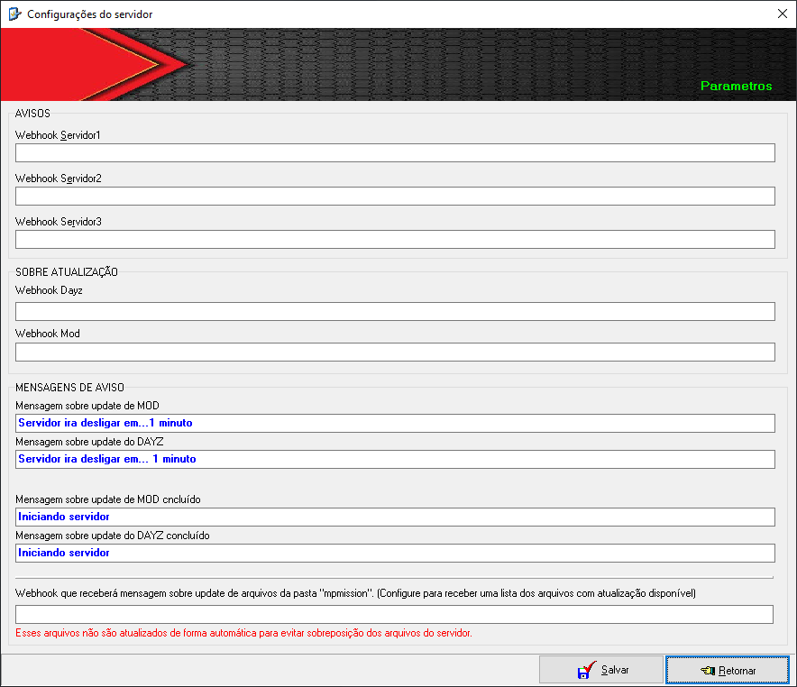  
Tela de configuração do webhook para Car Finder: 
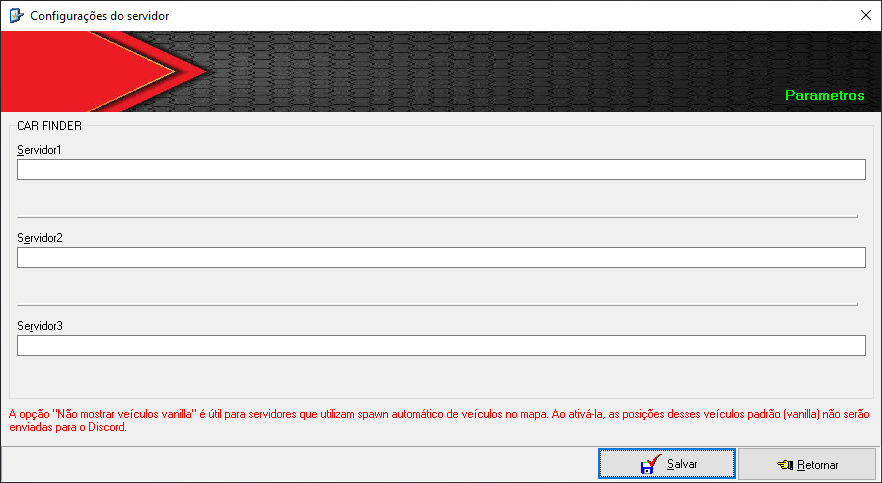  
Tela de configuração do webhook para Car Destroyed: 
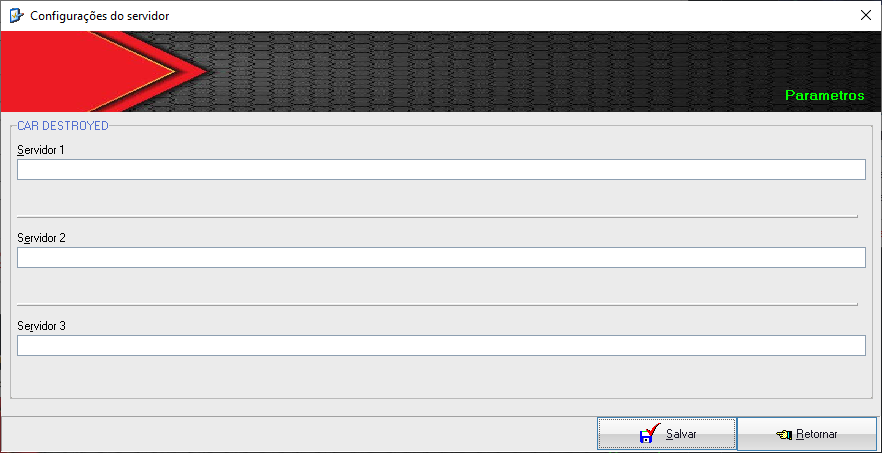  
Tela de configuração do webhook para KOTH: 
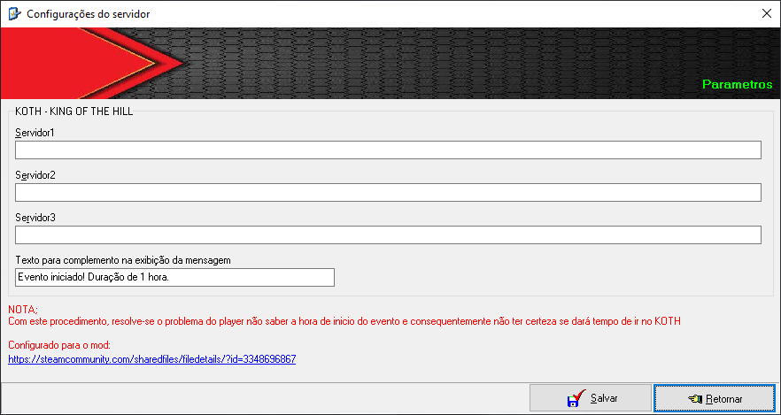  
Tela de configuração do webhook para Crash.log: 
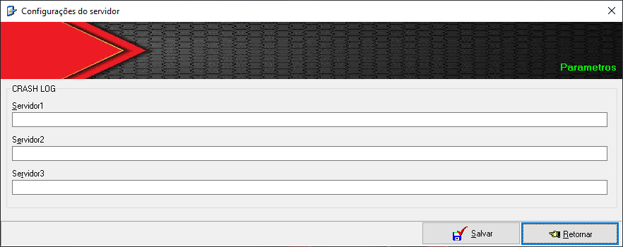  
Tela de configuração do webhook para Serverconsole.log: 
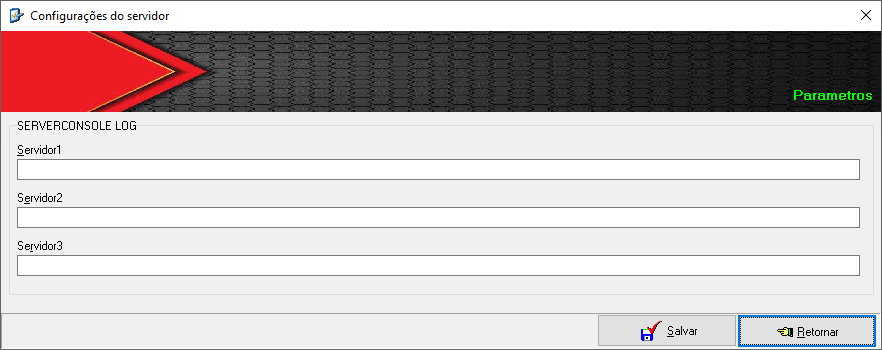  
Tela de configuração do webhook para Restart.log: 
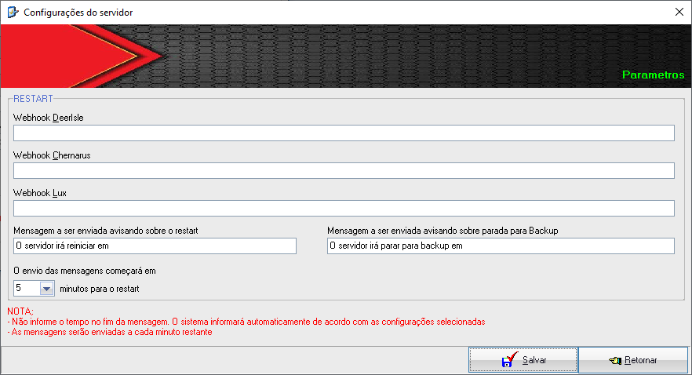  
Tela de configuração do Backup: 
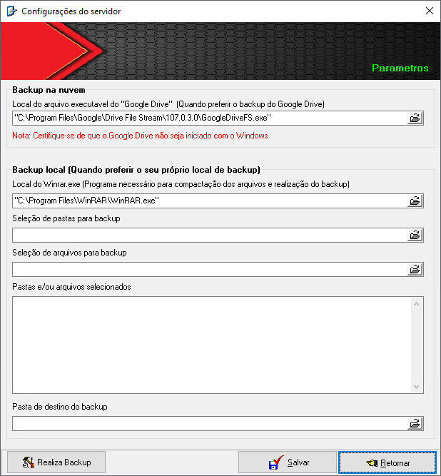  
Tela de configuração do Restart: 
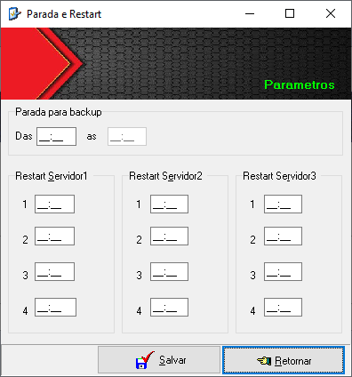  

