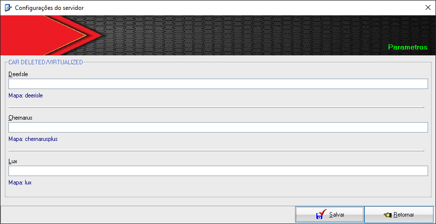
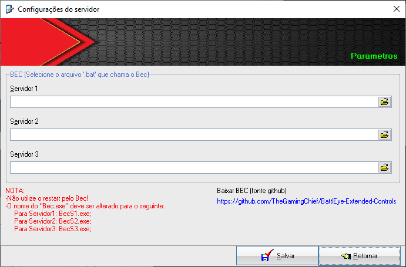
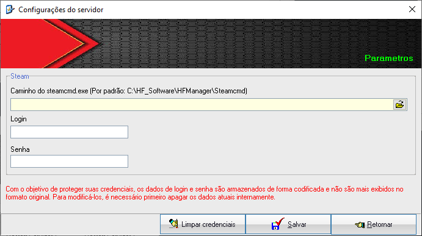
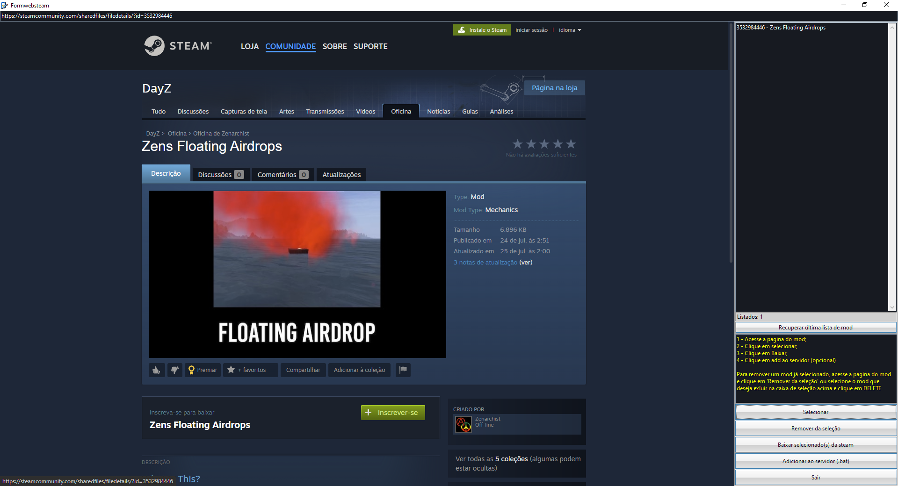
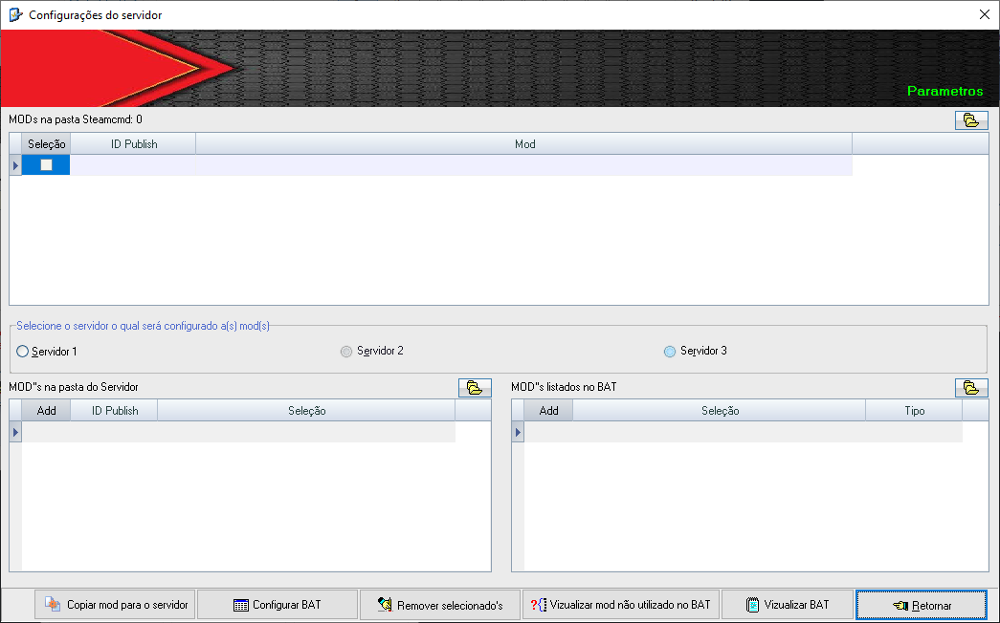
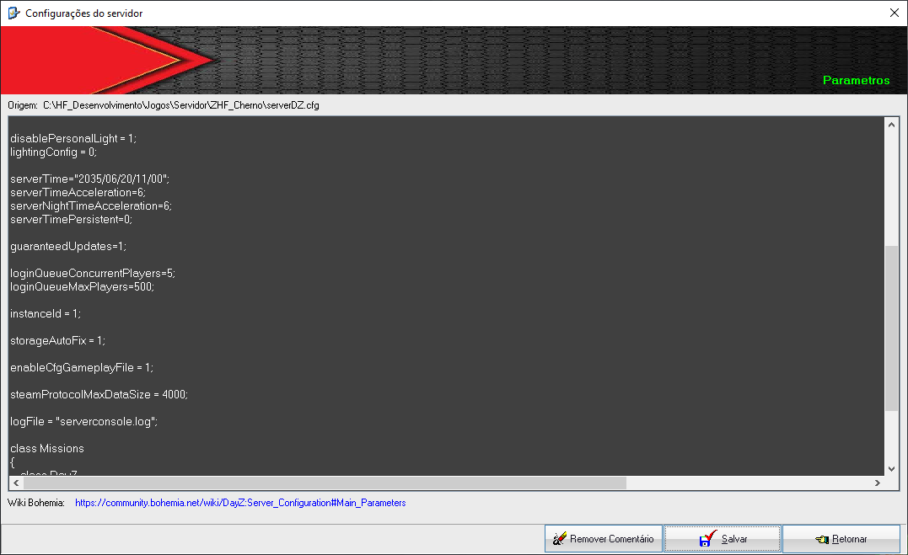
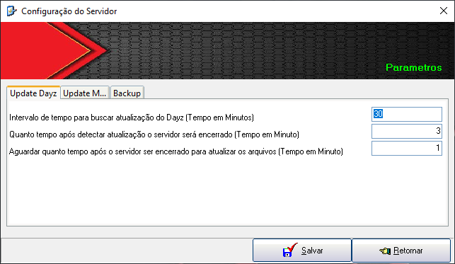
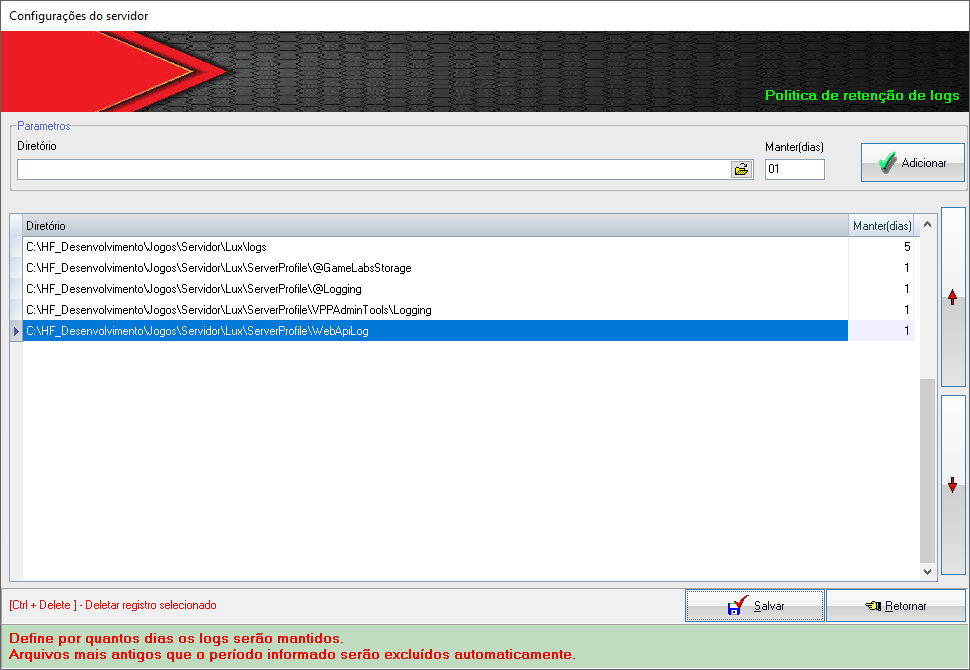

## HF Manager
Status: Ativo desde 01/2025   

O **HF Manager** é um sistema de gerenciamento de servidores **DayZ**, com suporte para monitoramento de até **3 servidores simultâneos**.

### ✨ Principais diferenciais
- Backup automático com sincronização na nuvem (**Google Drive**)
- Integração com **mods de terceiros** e com o **Discord**
- Envio automático dos arquivos **crash.log** e **serverconsole.log** para canais do Discord
- Codificação das **credenciais da Steam**, garantindo maior segurança
- Integração e monitoramento do **BEC**
- Agendamento automático de alterações no arquivo **ServerDZ.cfg**   
---

## INTEGRAÇÕES
- Steam
- Discord
- BEC
- RCON
---

## ADDONS COMPLEMENTARES
- HFMFixMCK.pbo
  
O que ele faz?
- Gera o arquivo HFM_Vehicle_fixMCK_.log, responsável por extrair o nome de classe dos veículos existentes no mapa, além de gerar log de interação com os veículos. O arquivo de log será gerado na pasta "profile"

Por que ele é necessário?
- Sem ele não é possiível utilizar a função: "Não mostrar veículos da lista" disponível em: Configurações > Webhook > Car in map (MCK)
- Também não é possível enviar qualquer log ao discord referente a veículos

Instalação
- A adição ou remoção deste "pbo" ocorre de forma automática desde que utilizado o sistema para adicionar ou remover mod's do arquivo "BAT". Este "pbo" é somente lado servidor e será copiado para a pasta "Addons" do servidor.

Nota:

- Este "pbo" possuí dependência do mod "MuchCarKey", portanto se remover o "MuchCarKey" do seu arquivo "BAT" de forma manual, remova também este ".pbo" da pasta "Addons" do seu servidor
---

TAREFAS EXECUTADAS
---

### MONITORAMENTO
   - Monitora se o servidor está ativo e, caso tenha caído, o inicia novamente;

### BACKUP
   - Desligamento automático em horário predefinido para realização de backup;
   - Realiza backup em local definido pelo usuário;
   - Realiza o backup de qualquer arquivo ou pasta selecionada;
   - Sincronização do backup na nuvem;
   - Inicialização do servidor após concluir o processo de backup;
   - Remoção de backup antigo de forma automática, de acordo com o configurado.

### RESTART
   - Restart em horário predefinido;
   - Envio de mensagem ao discord informando sobre a aproximação do restart com possíbilidade de informar o
     tempo restante.

### UPDATE DE MOD E DAYZ
   - Envia mensagem ao discord informando sobre atualizações disponíveis e que o servidor será encerrado,
     informando também na mensagem o tempo para desligamento de acordo com o configurado;
   - Envia mensagem ao discord informando quais MODS ou versão do DAYZ houve atualização;
   - Envia mensagem ao discord informando que o processo de atualização terminou e que o servidor será iniciado;
   - Mods que não estão em uso no servidor, serão atualizados de forma silenciosa;
   - Nas atualizações do Dayz, os arquivos da pasta 'mpmission' não são atualizados automaticamente. No entanto,
     quando o Webhook estiver devidamente configurado, o administrador será notificado sobre quais arquivos 
     sofreram alterações. Essa funcionalidade evita sobscrever arquivos modificados em uso no servidor.

### STEAM
   - Integração com a Steam para: Baixar, atualizar e monitorar atualizações de mod de forma automática;
   - Login e senha da steam são codificados, evitando sua exposição e mantendo a segurança dos dados.

### GERENCIADOR DE MOD INSTALADO
   - Exibe em uma única tela os seguintes dados
        - Todos os mod baixados da steam;
        - Todos os mod na pasta do servidor;
        - Todos os mod em uso no BAT.
        - Possíbilidade de remover mod da pasta da steam, da raiz do servidor e também em uso com um único 
          clique, evitando acumulo de mod baixado sem estarem em uso;
        - Possíbilidade de veríficar quais MODS não estão em uso no servidor, através de comparativo entre:
          pasta da steam | raiz do servidor | listados no bat  
        - Possíbilidade de Editar/Vizualizar o arquivo bat sem precisar navegar até a pasta do servidor

### BEC
   - Opção para inicialização e monitoramento de forma automática;

### SERVERDZ.CFG
   - Possíbilidade de agendamento de alteração deste arquivo para o próximo restart do servidor, com isso não é
     necessário parar o servidor ou ficar aguardando restart para realizar tais alterações.

### PARAMETRO UPDATE
   - Opção para definir o tempo de intervalo para:
     - Monitoramento de atualizações de MOD e DAYZ;
     - Tempo para encerrar o servidor após detectar atualizações.	 

### VEÍCULOS
   - Integração com MOD: MCK
     - Ao iniciar o servidor, será enviado ao discord, log dos veículos encontrados no mapa e sua respectiva 
       localização. Há possíbilidade de informar quais veículos não devem ser informado a localização;
     - Quando um veículo for destruído, será enviado ao discord, log informando o veículo e sua localização;
     - Quando um veículo for para garavem virtual, será enviado ao discord, log informando o veículo e sua
       localização.

### KOTH
   - Integração com MZ KOTH
      - Monitora spaw do KOTH e envia a hora de inicio do evento para o discord;
      - Com este procedimento, resolve-se o problema do player não saber se dará tempo de ir ao KOTH;

### LOGS DIVERSOS
   - Move arquivos de log da pasta "Profile" para a pasta "log" na raiz do servidor, organizando-os por data
     sempre que o servidor reiniciar;
   - Opção apra definir quais logs serão movidos da pasta profile para logs;
   - Opção para definir a Política de logs, permitindo definir quais logs serão mantidos e por quanto tempo.

### LOGS ADM
   - Possibilidade de envio do arquivo "crash" para o discord;
   - Possibilidade de envio do arquivo "serverconsole" para o discord;
        
### IP
   - Monitora mudanças no IP e, caso ocorram, envia uma mensagem para o Discord informando sobre a alteração.

### LOGS GERADOS PELO SISTEMA
   - Remoção de log antigo de forma automática;

### SHUTDOWN
   - Criação do arquivo "shutdown.bat" de forma automática;
---
 

- Discord: https://discord.gg/Sfvm9TMRur
- Instalador: https://github.com/hfsoftwaree/HFManagerUpdate/releases/download/installer/hfmanager.exe
- Como configurar: https://www.youtube.com/watch?v=sF_Hs_HkSzE&t=186s
  
Tela de monitoramento do sistema: 
  
Tela de configuração de diretórios: 
  
Tela de configuração para atualização de MOD: 
  
Tela de configuração para atualização do DAYZ: 
  
Tela de configuração do webhook Update Mod e Dayz: 
  
Tela de configuração do webhook para Car Finder: 
  
Tela de configuração do webhook para Car Destroyed: 
  
Tela de configuração do webhook para Car Deleted: 
  
Tela de configuração do webhook para KOTH: 
  
Tela de configuração do webhook para Crash.log: 
  
Tela de configuração do webhook para Serverconsole.log: 
  
Tela de configuração do webhook para Restart.log: 
  
Tela de configuração do Backup: 
  
Tela de configuração do Restart: 
  
Tela de configuração da integração com BEC: 
  
Tela de configuração da integração com Steam - Credenciais: 
  
Tela de configuração da integração com Steam - Baixar MOD: 
  
Tela de configuração da integração com Steam - Gerenciar MOD: 
  
Tela de configuração do arquivo ServerDZ.cfg: 
  
Tela de configuração de parametros: 
  
Tela de configuração de Politica de Logs: 
  

